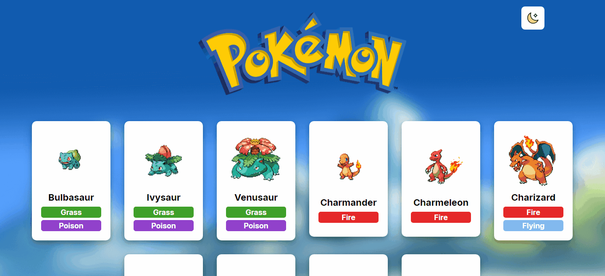
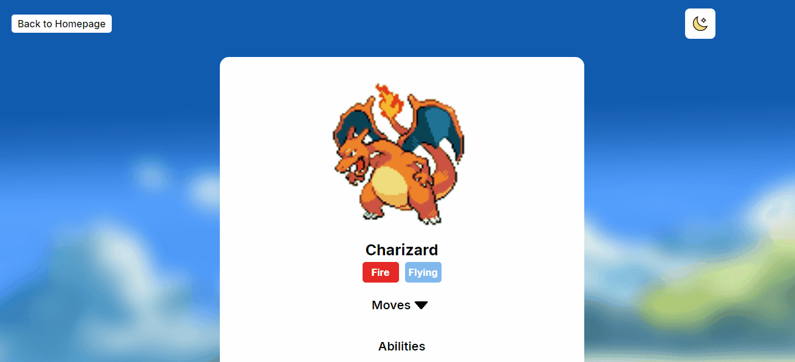

# **React Pokedex**

## **Descrição do Projeto**

O projeto React Pokedex consiste em uma aplicação React que utiliza a [PokeApi](https://pokeapi.co) para exibir uma lista de Pokemons e informações detalhadas sobre um Pokemon específico.

---

## **Funcionalidades**

- **Listagem de Pokemons** :  
    A página inicia com uma lista inicial de cartões de dez pokemons, cada cartão possui a imagem, o nome e o(s) tipo(s) de um pokemon específico.

     

     

- **Perfil detalhado do Pokemon** :  
    Ao clicar em um pokemon da lista, o usuário é redirecionado para uma seção que contém o nome, imagem, tipo(s), ataques e habilidades do pokemon clicado.

     

     

- **Botão de voltar a Tela Inicial** :  
    É um botão localizado no canto superior esquerdo na seção de perfil do pokemon que ao ser clicado redireciona a página para a tela inicial.

     

     

- **Botão de Carregar Mais** :  
    É um botão localizado no final da página que ao ser clicado exibe mais dez pokemons na lista.

     

     

-  **Botão alternador de tema** :  
    É um botão localizado no canto superior esquerdo da página que ao ser clicado altera o tema da página para escuro ou claro, sendo o tema claro padrão ao iniciar o projeto.

     

     

---

## Ferramentas Utilizadas

**Vite**:  
Ferramenta de construção  moderna para projetos web, que oferece uma experiência de desenvolvimento extremamente rápida e eficiente. Foi utilizada porque prefiro utilizar o Vite para trabalhar com projetos React em vez do Create React App.

**React**:  
Biblioteca Javascript como foco em criar interfaces de usuário declarativas e dinâmicas, especialmente para aplicações de página única (Single Page Applications - SPAs).

**React-Router-Dom**:  
Biblioteca complementar ao React que permite a criação e gerenciamento de rotas em aplicações web de página única. Com essa ferramenta foi possível transitar entre perfil detalhado dos pokemons e tela inicial de forma fluída e rápida, já que com ela não é preciso recarregar a página para isso.

**ContextAPI**:  
Ferramenta nativa do React que permite compartilhar dados e estado global entre componentes, sem a necessidade de passar props manualmente em cada nível da árvore de componentes. A ContextAPI foi utilizada para criar a lógica do botão alternador de temas e assim passar essas informações entre os componentes.

**Styled-Components**:  
Biblioteca para React que permite escrever estilos de componentes em JavaScript. Assim foi possível definir estilos diretamente em certos componentes, sem a necessidade de criar um arquivo Css externo para estilização desses componentes.

**Axios**:  
Biblioteca baseada em JavaScript usada para fazer requisições HTTP de forma simples e eficiente. Com o Axios foi possível se comunicar com a [PokeApi](https://pokeapi.co) de forma simplificada, já que ele automaticamente transforma os dados recebidos em formato JSON, sendo uma melhor opção em relação ao Fetch.

---

## Como rodar o projeto

---

## Decisões adotadas no projeto

### Utilizando o Axios
Decidi utilizar o Axios nesse projeto em vez de usar o convencional Fetch. Pelo fato do Axios transformar os dados recebidos da API diretamente em arquivo JSON deixou o código mais compreensível e limpo, já que com o Fetch seria necessário transformar os dados da API em JSON antes de conseguir utilizá-los no código, dessa maneira o código possuiria mais linhas.

### Utilizando a ContextAPI
Utilizei a ContextAPI para criar a animação de abertura de fechamento da seta na parte dos Ataques do Pokemon. Senti que foi a melhor forma de criar essa animação da seta dos ataques.

### Utilizando o hook useRef
Com esse hook consegui criar uma função que é chamada ao clicar na seta dos Ataques, assim fechando e abrindo a lista de ataques conforme o usuário decidir. Decidi utilizar esse hook porque foi a melhor maneira que encontrei de realizar essa funcionalidade, já que senti que o perfil do pokemon ficaria muito poluído caso não houvesse a opção de fechar a lista de ataques.

### Utizando Css externo para estilização
Apesar do desafio pedir o Styled Components para estilização, senti que alguns arquivos possuiriam muitas linhas de código caso eu utilizasse Styled Components para estilizar tudo. Então decidi usar o Styled Components apenas para estilizações que não possuiriam muitas linhas de códido, e as que possuiriam muitas linhas de códigos decidi criar um arquivo Css Externo.